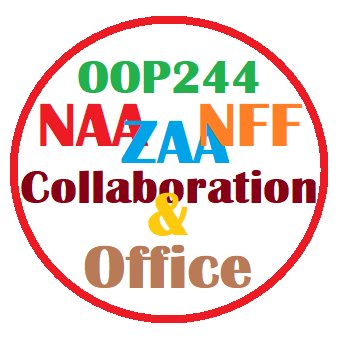

# OOP244 NAA ZAA and NFF Notes

## Active Session 
You are welcome to Fardad's classes as a guest by **using your real Seneca Name** (what is on your student card, otherwise you will be kicked out).

Click on the link below to join: (See [my schedule](#fardads-schedule) for lecture times) 
[OOP244 the session by Fardad (midterm test in progress)](https://connect.rna2.blindsidenetworks.com/invite/to?c=F8Wik2s8hA-CPWdF1gaOJ6W-WnHCRYJyhwx3rqWZ8I8&m=b7fe85c17961b55f19a6ca04cdcf3d2833643097&t=1655825610109&u=senecacollege)

## Workshop Zero
As a student in my class, you are to start your semester by familiarizing yourself with GitHub so you can share your daily work with me for advice/help, collaboration and monitoring your progress. 

This is done using what I call Workshop Zero; through a series of videos instructing you on how to set up your computer to use GitHub effectively for collaboration.
 
We will start this together in the first class (make sure you attend) but the detailed instructions of the workshop will be announced shortly.

Here are the Videos. The duedate for [Workshop Zero](https://www.youtube.com/playlist?list=PLxB4x6RkylouixUhNXf0MuwccLriA0DGC) is Friday May 20th.

https://www.youtube.com/playlist?list=PLxB4x6RkylouixUhNXf0MuwccLriA0DGC

## 144100 review session  for 244200 students
The review session on IPC144/BTP100 was held on monday may 13th at 10 AM 
This session was open to all the students who needed to review the 144/100 concepts before starting 244/200 subjects. 

### 144/100 Review Recrodings

- [Part 1 (BBB)](https://recordings.rna2.blindsidenetworks.com/senecacollege/142746f4e9d27ffabde29661522c53351062c6d5-1652708621059/capture/)
- [Part 2 (BBB)](https://recordings.rna2.blindsidenetworks.com/senecacollege/142746f4e9d27ffabde29661522c53351062c6d5-1652719820097/capture/)

## Recordings of Previous (NAA,NFF and ZAA) lecture Sessions
I strongly suggest for students to review other section's recordings as well, if time permits...
### NAA
- [May 11 - Welcome and Workshop Zero](https://recordings.rna2.blindsidenetworks.com/senecacollege/f1b4cc38392954b179ed80e861823cbdb192d39e-1652299915616/capture/)
- [May 13 - OOP, Objects, Modular](https://recordings.rna2.blindsidenetworks.com/senecacollege/f1b4cc38392954b179ed80e861823cbdb192d39e-1652446251689/capture/)
- [May 18 - OOP, Objects, Modular, types and overloading](https://recordings.rna2.blindsidenetworks.com/senecacollege/f1b4cc38392954b179ed80e861823cbdb192d39e-1652904147019/capture/)
- [May 20 - Types References and overloading](https://recordings.rna2.blindsidenetworks.com/senecacollege/f1b4cc38392954b179ed80e861823cbdb192d39e-1653051000408/capture/)
- [May 25 - DMA and Scopes](https://recordings.rna2.blindsidenetworks.com/senecacollege/f1b4cc38392954b179ed80e861823cbdb192d39e-1653509025294/capture/)
- [May 27 - Member functions and privacy](https://recordings.rna2.blindsidenetworks.com/senecacollege/f1b4cc38392954b179ed80e861823cbdb192d39e-1653655313749/capture/)
- [June 1 - IO formatting and fool proof data entry (class canceled, watch recording from NFF)](https://recordings.rna2.blindsidenetworks.com/senecacollege/fa2e70d93458902e8c20d7c6ed16f63a6d8ad2d4-1654020794757/capture/)
- [June 3 - Constructors, Destructors and this](https://youtu.be/P7SVGBgEhKc)
- [June 8 - Constructors, Destructors and this And Operator Overload Intro](https://youtu.be/bE_FUT0MUkQ)
- [June 10 - Operator Overloading](https://recordings.rna2.blindsidenetworks.com/senecacollege/f1b4cc38392954b179ed80e861823cbdb192d39e-1654864360470/capture/)
- [June 15 - Casting and index overload and rule of three](https://recordings.rna2.blindsidenetworks.com/senecacollege/f1b4cc38392954b179ed80e861823cbdb192d39e-1655323575902/capture/)
### NFF
- [May 10, Welcome and Workshop Zero](https://recordings.rna2.blindsidenetworks.com/senecacollege/fa2e70d93458902e8c20d7c6ed16f63a6d8ad2d4-1652207698859/capture/)
- [May 12 - OOP, Objects, Modular](https://recordings.rna2.blindsidenetworks.com/senecacollege/fa2e70d93458902e8c20d7c6ed16f63a6d8ad2d4-1652376592197/capture/)
- [May 17 - OOP, Objects, Modular, types and overloading](https://recordings.rna2.blindsidenetworks.com/senecacollege/fa2e70d93458902e8c20d7c6ed16f63a6d8ad2d4-1652811401313/capture/)
- [May 19 - Types, References, Overloading and DMA](https://recordings.rna2.blindsidenetworks.com/senecacollege/fa2e70d93458902e8c20d7c6ed16f63a6d8ad2d4-1652980520082/capture/)
- [May 24 - DMA and scopes](https://recordings.rna2.blindsidenetworks.com/senecacollege/fa2e70d93458902e8c20d7c6ed16f63a6d8ad2d4-1653416406042/capture/)
- [May 26 - Member functions and privacy](https://recordings.rna2.blindsidenetworks.com/senecacollege/fa2e70d93458902e8c20d7c6ed16f63a6d8ad2d4-1653586126080/capture/)
- [May 31 - IO formatting and fool proof data entry](https://recordings.rna2.blindsidenetworks.com/senecacollege/fa2e70d93458902e8c20d7c6ed16f63a6d8ad2d4-1654020794757/capture/)
- [June 02 - Constructors Destructors and this](https://youtu.be/wC91sOOeqq0)
- [June 07 - Constructors, Destructors and this And Operator Overload Intro](https://recordings.rna2.blindsidenetworks.com/senecacollege/fa2e70d93458902e8c20d7c6ed16f63a6d8ad2d4-1654626300260/capture/)
- [June 09 - Operator overloading](https://recordings.rna2.blindsidenetworks.com/senecacollege/fa2e70d93458902e8c20d7c6ed16f63a6d8ad2d4-1654794893776/capture/)
- [June 14 - Conversion Overload, Index Overload, Classes and resources](https://recordings.rna2.blindsidenetworks.com/senecacollege/fa2e70d93458902e8c20d7c6ed16f63a6d8ad2d4-1655231038777/capture/)
### ZAA
- [May 10, Welcome and Workshop Zero](https://recordings.rna2.blindsidenetworks.com/senecacollege/0dabe5cbd5afd3dadba550ee8fe20e329616e8f6-1652196588984/capture/)
- [May 12 - OOP, Objects, Modular](https://recordings.rna2.blindsidenetworks.com/senecacollege/0dabe5cbd5afd3dadba550ee8fe20e329616e8f6-1652363284601/capture/)
- [May 17 - OOP, Objects, Modular, types references and overloading](https://recordings.rna2.blindsidenetworks.com/senecacollege/0dabe5cbd5afd3dadba550ee8fe20e329616e8f6-1652801643799/capture/)
- [May 19  - Types references, overloading DMA](https://recordings.rna2.blindsidenetworks.com/senecacollege/0dabe5cbd5afd3dadba550ee8fe20e329616e8f6-1652967967286/capture/)
- [May 24 - DMA, scopes](https://recordings.rna2.blindsidenetworks.com/senecacollege/0dabe5cbd5afd3dadba550ee8fe20e329616e8f6-1653406200614/capture/)
- [May 26 - member functions and privacy](https://recordings.rna2.blindsidenetworks.com/senecacollege/0dabe5cbd5afd3dadba550ee8fe20e329616e8f6-1653572448069/capture/)
- [May 31 - IO formatting and fool proof data entry](https://recordings.rna2.blindsidenetworks.com/senecacollege/0dabe5cbd5afd3dadba550ee8fe20e329616e8f6-1654011114209/capture/)
- [June 02 - Constructors Destructors and this](https://recordings.rna2.blindsidenetworks.com/senecacollege/0dabe5cbd5afd3dadba550ee8fe20e329616e8f6-1654177937338/capture/)
- [June 07 - Constructors, Destructors and this And Operator Overload Intro](https://recordings.rna2.blindsidenetworks.com/senecacollege/0dabe5cbd5afd3dadba550ee8fe20e329616e8f6-1654615600280/capture/)
- [June 09 - Operator overloading](https://recordings.rna2.blindsidenetworks.com/senecacollege/0dabe5cbd5afd3dadba550ee8fe20e329616e8f6-1654782259632/capture/)
- [June 14 - Conversion Overload, Index Overload, Classes and resources](https://recordings.rna2.blindsidenetworks.com/senecacollege/0dabe5cbd5afd3dadba550ee8fe20e329616e8f6-1655221209988/capture/)
## IPC144 Review Session  for OOP244 Students
The review session on IPC144/BTP100 was held on monday may 13th at 10 AM
This session was open to all the students who needed to review the 144/100 concepts before starting 244/200 subjects.

[144/100 Review Recrodings](https://github.com/Seneca-244200/OOP244-NAA-ZAA-NFF-Notes/blob/main/README.md#144100-review-recrodings)

# Office

# Fardad's Schedule
| Period | Start-Stop  | Mon | Tue | Wed | Thu | Fri |
|--------|-------------|-----|-----|-----|------|------|
| 1      | 8:00-8:50   |     |     |     |      |    |
| 2      | 8:55-9:45   |  DEV   |     |     |      |  OOP244 NAA (Lecture)    |
| 3      | 9:50-10:40  |  DEV   |     |     |  OOP244 ZAA (Lecture)    |   OOP244 NAA (Lecture)     |
| 4      | 10:45-11:35 |  DEV   |  |     |  OOP244 ZAA (Lecture)   |   [Office](https://teams.microsoft.com/l/channel/19%3aIKWDc3mg4DBZiX349JU6HiLjVaunOG5ASsf66aIpu5s1%40thread.tacv2/General?groupId=91c2461a-ea04-4362-8af7-0cc1b919c520&tenantId=eb34f74a-58e7-4a8b-9e59-433e4c412757)   |
| 5      | 11:40-12:30 |  DEV   |  OOP244 ZAA (Lecture/Q&A)   |     |  [Office](https://teams.microsoft.com/l/channel/19%3aIKWDc3mg4DBZiX349JU6HiLjVaunOG5ASsf66aIpu5s1%40thread.tacv2/General?groupId=91c2461a-ea04-4362-8af7-0cc1b919c520&tenantId=eb34f74a-58e7-4a8b-9e59-433e4c412757)    |      |
| 6      | 12:35-13:25 |  DEV   |  OOP244 ZAA (Lecture/Q&A)   |     |      |      |
| 7      | 13:30-14:20 |  DEV   |     |     |  OOP244 NFF (Lecture)    |      |
| 8      | 14:25-15:15 |  DEV   |  OOP244 NFF (Lecture/Q&A)     |     |  OOP244 NFF (Lecture)    |      |
| 9      | 15:20-16:10 |  DEV   |  OOP244 NFF (Lecture/Q&A)    |     |      |      |
| 10     | 16:15-17:05 |  DEV   |     |  OOP244 NAA (Lecture/Q&A)   |      |      |
| 11     | 17:10-18:00 |        |     |  OOP244 NAA (Lecture/Q&A)   |      |      |

# Workshop Zero
If you need help with your code you should have your computer setup and create a private GitHub repo and add me as a collaborator, [Follow the instructions of Workshop zero to get ready](https://www.youtube.com/watch?v=D6B0rXJYhTI&list=PLxB4x6RkylouixUhNXf0MuwccLriA0DGC&ab_channel=FardadSoleimanloo).
