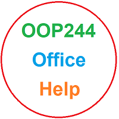

# OOP244 NAA and ZAA Notes

## Workshop Zero
As a student in my class, you are to start your semester by familiarizing yourself with GitHub so you can share your daily work with me for advice/help, collaboration and monitoring your progress. 

This is done using what I call Workshop Zero; through a series of videos instructing you on how to set up your computer to use GitHub effectively for collaboration.
 
We will start this together in the first lab (make sure you attend and bring your computers) but the detailed instructions of the workshop will be announced shortly.

Here are the Videos. The due date for [Workshop Zero](https://www.youtube.com/playlist?list=PLxB4x6RkylouixUhNXf0MuwccLriA0DGC) is Monday Jan 16th.

https://www.youtube.com/playlist?list=PLxB4x6RkylouixUhNXf0MuwccLriA0DGC

### Mac Users and Workshop Zero
Workshop Zero is designed for windows, as you are required to learn and work with visual studio as an advanced IDE. 
For Mac, either you have to do all the git commands through command line, or you need to install a Virtual Machine and then do the lab:
- [Install Fusion Vmware](https://www.vmware.com/ca/products/fusion/fusion-evaluation.html) Fusion is free for students; click on ["Register Lisence for Personal Use"](https://customerconnect.vmware.com/web/vmware/evalcenter?p=fusion-player-personal) 
- [Install Windows 10 on Fusion VM](https://www.groovypost.com/howto/create-custom-virtual-machine-vmware-fusion/)

## 144100 review session  for 244200 students
The review session on IPC144/BTP100 was held on monday may 13th at 10 AM 
This session was open to all the students who needed to review the 144/100 concepts before starting 244/200 subjects. 

### 144/100 Review Recordings

- [Part 1 (BBB)](https://recordings.rna2.blindsidenetworks.com/senecacollege/142746f4e9d27ffabde29661522c53351062c6d5-1652708621059/capture/)
- [Part 2 (BBB)](https://recordings.rna2.blindsidenetworks.com/senecacollege/142746f4e9d27ffabde29661522c53351062c6d5-1652719820097/capture/)
- [Code](https://github.com/Seneca-244200/OOP244-NAA-and-ZAA-Notes/tree/main/144100Review)

## Recordings of Previous (NAA and NBB) lecture Sessions
I strongly suggest for students to review other section's recordings as well, if time permits...
### NAA
- [01 - Jan 10 Welcome and OO intro](https://youtu.be/VODzuPAUFDU)
- [02 - Jan 13 Workshop Zero](https://youtu.be/SfPAlLVOFh8)
- [03 - Jan 17 Function overloading, Defulat arg. values, references, cin/cout](https://youtu.be/R9M5c0FPIqM) 
- [04 - Jan 20, Pointers review, Dynamic Memory Allocation](https://youtu.be/DHpcdos-n2I)
- [05 - Jan 24 Encapsulation, Methods, Privacy, DMA Default Constructor, Destructor](https://youtu.be/bf_3zcudSXk)
- [06 - Jan 27 DMA, cin and cout formatting](https://youtu.be/pX9H-hA4gQ0)
- [07 - Jan 31 Constructors and foolproof data entry](https://youtu.be/3-GcmdPdlxY)
- [08 - Feb 07 Operator Overloading](https://youtu.be/dPGvLm18X2c)
- [09 - Feb 10 Operator Overloading](https://youtu.be/sVsWwxFpAZk)
- [10 - Feb 14 Rule of three, Files](https://youtu.be/ZhFzm8g54c0)
- [11 - Feb 17 Freinds](https://youtu.be/u4ZioDkkC2g)
- [12 - Feb 24 - Stages of initalization and more operator overloading](https://youtu.be/czkzmeuR1p0)
- [13 - Mar 07 - Project MS1 Overview](https://youtu.be/2OWD-szjMIw)
- [14 - Mar 07 - Derived classes and Virtuals](https://youtu.be/B707uj-Rvqs)
- [15 - Mar 14 - Pure Virtuals and interfaces](https://youtu.be/HU476JvpvJo)
- [16 - Mar 21 - Code submission for online tests in lab](https://youtu.be/v0uPwk0ITtE)
- [17 - Mar 21 - Milestone 3 Overview](https://youtu.be/5oL2RdYeWuo)
- [18 - Mar 21 - Derived classes with resources](https://youtu.be/fovR5GRMca4)
- [19 - Milestone 4 Overview](https://youtu.be/urtlxJHtEC8)
- [20 - Milestone 5 Overview](https://youtu.be/E_CRdXMSgTE)
- [21 - Mar 28 - Function Templates](https://youtu.be/XSgJ-DzTuc0)
- [22 - Apr 04 - Function Template Specialization and Class Templates](https://youtu.be/2_F26gSiQuw)

### ZAA
- [01 - Jan 09 Welcome and OO intro](https://youtu.be/k2-i_HTruE4)
- [02 - Jan 12 Workshop Zero](https://youtu.be/tX8yihHl9dI)
- [03 - Jan 16, Function overloading, Defulat arg. values, references, cin/cout](https://youtu.be/G1UDVxcOhEg)
- [04 - Jan 19, Pointers review, Dynamic Memory Allocation](https://youtu.be/DJ0QLQtv4mI)
- 05 - Jan 23 Encapsulation, Methods, Privacy, DMA Default Constructor, Destructor
   - [Part 1 - Coding](https://youtu.be/MgFAef9XLZk)
   - [Part 2 - Slides (to do and don'ts)](https://youtu.be/8p8fi3qjh88) 
- [06 - jan 26 - DMA and cin and cout formating](https://youtu.be/xgEe2nSMSm8)
- [07 - Jan 30 - Constructors and foolproof data entry](https://youtu.be/ijeTDVgzfK8)
- [08 - Feb 06 - Operator Overloading](https://youtu.be/iv9K5O0X5bI)
- [09 - Feb 09 - Operator Overloading](https://youtu.be/R2fyqlP9VXg)
- [10 - Feb 13 - Rule of three, Files](https://youtu.be/th-rlD9CAL4)
- [11 - Feb 17 Freinds (NAA recording, but watch please)](https://youtu.be/u4ZioDkkC2g)
- [12 - Feb 23 - Stages of initalization and more operator overloading](https://youtu.be/UuXwSPgwvrA)
- [13 - Mar 6 - MS1 overview](https://youtu.be/3I-uAGcbQX8)
- [14 - Mar 6 - Derived classes and virtuality](https://youtu.be/pcP8V5g1ljQ)
- [15 - Mar 13 - Project MS2 overview](https://youtu.be/A9a4i5TChAc)
- 16 - Mar 13 - Abstract Base classes, Interfaces, Virtuals [Part 1](https://youtu.be/qXj1kZh75vc) - [Part 2](https://youtu.be/jWrqwrFQkgI)
- [17 - Mar 20 - How to do coding submission for online tests in the lab.](https://youtu.be/dPx9pzqLdZo)
- [18 - Mar 20 - Derived classes with resource](https://youtu.be/xILuwGSxuu0)
- [19 - Milestone 4 Overview](https://youtu.be/urtlxJHtEC8)
- [20 - Milestone 5 Overview](https://youtu.be/E_CRdXMSgTE)
- [21 - Mar 27 Function Templates](https://youtu.be/uhjuNN-cQwc)
- [22 - Apr 04 - Function Template Specialization and Class Templates](https://youtu.be/2_F26gSiQuw)

# Office

For Help and office times, click on my  [Office](https://teams.microsoft.com/l/channel/19%3adWp8NHtKn8C43A1EsfN70Dkxi00NNSdWT5H_5RzVDI41%40thread.tacv2/General?groupId=c8867f6e-1fdd-4571-851b-6f5907940a53&tenantId=eb34f74a-58e7-4a8b-9e59-433e4c412757)  link to go to MS Teams, then click on the calendar icon and book a meeting using Scheduling Assistant to make sure it does not have a confilict with my other work activities.

# Fardad's Schedule
| Period | Start-Stop  | Mon | Tue | Wed | Thu | Fri |
|--------|-------------|:-----------------:|:-----------------:|:-----------------:|:-----------------:|:-----------------:|
| 1      | 8:00-8:50   |     |     |     |      |    |
| 2      | 8:55-9:45   |     |     |     |      |     |
| 3      | 9:50-10:40  |     |   OOP244 NAA   Lecture: A3504   |     |     |        |
| 4      | 10:45-11:35 |     |  OOP244 NAA   Lecture: A3504  |     |    |      |
| 5      | 11:40-12:30 |   |  IPC144 NBB   Lecture: A1431A   |     |     |  OOP244 NAAL   Lec/Lab: A3512  |
| 6      | 12:35-13:25 |  OOP244 ZAA   Lecture: M570   |  IPC144N BB   Lecture: A1431A    |      |      |   OOP244 NAAL   Lec/Lab: A3512     |
| 7      | 13:30-14:20 |  OOP244 ZAA   Lecture: M570   |     |       |  OOP244 ZAAL   Lec/Lab: M614    |      |
| 8      | 14:25-15:15 |     |       |     |  OOP244 ZAAL   Lec/Lab: M614  |      |
| 9      | 15:20-16:10 |     |      |     |      |    IPC144 NBB   Lec/lab: A1508    |
| 10     | 16:15-17:05 |     |   |    |      |   IPC144 NBB   Lec/lab: A1508   |
| 11     | 17:10-18:00 |       |     |     |      |      |
| 12     | 18:05-18:55 |       |     |   |      |      |
