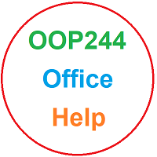

# OOP244 NAA and ZAA Notes
## Workshop Zero
As a student in my C++ course, you must familiarize yourself with GitHub so you can share your daily work with me for advice, help, collaboration, and monitoring of your progress.

To get started, I have created a series of videos called Workshop Zero that will instruct you on how to set up your computer to use GitHub effectively for collaboration. The due date for Workshop Zero is Monday, January 15th.

Please watch the videos and listen to the instructions carefully. As a computer science student, you must learn to be precise and exact in your work. Follow the instructions EXACTLY as instructed, especially the last step of the Workshop.

Here are the Videos. Again, the due date for [Workshop Zero](https://youtube.com/playlist?list=PLxB4x6RkylouixUhNXf0MuwccLriA0DGC&si=cryJ9pUfUTK7jKcl) is Monday, January 15th; start your work now!!

https://youtube.com/playlist?list=PLxB4x6RkylouixUhNXf0MuwccLriA0DGC&si=cryJ9pUfUTK7jKcl
 
## Mac Users
If you are working on a Mac, you are required to learn and work with Visual Studio as an advanced IDE, especially in future semesters. To use Visual Studio on a Mac, you can either do all the git commands through the command line and use XCode (which you cannot use in future Windows-related subjects), or you can install a Virtual Machine and run Windows on your Mac. This will have Windows running in a window on your Mac without losing your Mac settings and features.

Here are the steps to install Fusion Vmware and Windows 10 on Fusion VM:

- [Install Fusion Vmware](https://www.vmware.com/ca/products/fusion/fusion-evaluation.html). Fusion is free for students; click on ["Register License for Personal Use"](https://customerconnect.vmware.com/web/vmware/evalcenter?p=fusion-player-personal) 
- [Install Windows 10 on Fusion VM](https://www.groovypost.com/howto/create-custom-virtual-machine-vmware-fusion/)

## 144100 review session  for 244200 students
The review session on IPC144/BTP100 was held last year 
This session was open to all the students who needed to review the 144/100 concepts before starting 244/200 subjects. 

You can view the recordings below and review the code to make your base knowledge stronger for C++.

### 144/100 Review Recordings

- [Part 1 (BBB)](https://recordings.rna2.blindsidenetworks.com/senecacollege/142746f4e9d27ffabde29661522c53351062c6d5-1652708621059/capture/)
- [Part 2 (BBB)](https://recordings.rna2.blindsidenetworks.com/senecacollege/142746f4e9d27ffabde29661522c53351062c6d5-1652719820097/capture/)
- [Code](144100Review/Code/)

### Lecture recordings
See the section directories: <a href="NAA/README.md" target="_blank">NAA</a> - <a href="ZAA/README.md" target="_blank">ZAA</a>

# Office

For Help and office times, click on my  [Office](https://teams.microsoft.com/l/channel/19%3a-kl-cZzTDzUR95D8IBlRvmkcjWRXCBP6coVv2d-w3lU1%40thread.tacv2/General?groupId=f238081f-e23a-4400-95eb-7469084fc3d7&tenantId=eb34f74a-58e7-4a8b-9e59-433e4c412757)  link to go to MS Teams, then click on the calendar icon and book a meeting using [**Scheduling Assistant**](https://www.youtube.com/watch?v=RLDoP3eXAUU&ab_channel=FardadSoleimanloo) to make sure it does not have a conflict with my other work activities.

# Fardad's Schedule
| Period | Start-Stop  | Mon | Tue | Wed | Thu | Fri |
|--------|-------------|:-----------------:|:-----------------:|:-----------------:|:-----------------:|:-----------------:|
| 1      | 8:00-8:50   |    |  OOP244NAA   Lecture: A3504  |    |    |  OOP244ZAA   Lec/Lab: M664  |
| 2      | 8:55-9:45   |    |  OOP244NAA   Lecture: A3504  |    |    |  OOP244ZAA   Lec/Lab: M664  |
| 3      | 9:50-10:40  |    |  IPC144NBB   Lecture: A4519  |  OOP244ZAA   Lecture: M658  |  IPC144NBB   Lec/Lab: B1081  |    |
| 4      | 10:45-11:35 |    |  IPC144NBB   Lecture: A4519  |  OOP244ZAA   Lecture: M658  |  IPC144NBB   Lec/Lab: B1081  |    |
| 5      | 11:40-12:30 |    |    |    |  OOP244NAA   Lec/LAB: A4516  |    |
| 6      | 12:35-13:25 |    |    |    |  OOP244NAA   Lec/LAB: A4516  |    |
| 7      | 13:30-14:20 |    |    |    |    |    |
| 8      | 14:25-15:15 |    |    |    |    |    |
| 9      | 15:20-16:10 |    |    |    |    |    |
| 10     | 16:15-17:05 |    |    |    |    |    |
| 11     | 17:10-18:00 |    |    |    |    |    |
| 12     | 18:05-18:55 |    |    |    |    |    |

